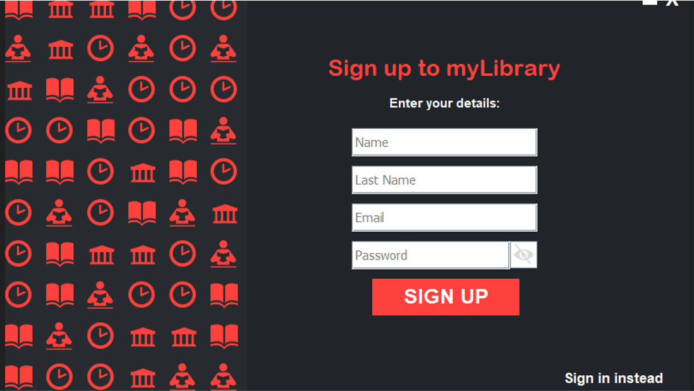

[![Contributors][contributors-shield]][contributors-url]
[![Stargazers][stars-shield]][stars-url]
[![Issues][issues-shield]][issues-url]
[![GNU GPLv3 License][license-shield]][license-url]


<!-- PROJECT LOGO -->
<br />
<p align="center">
  <a href="https://github.com/MetinUsta/KitHub">
    
  </a>

  <h3 align="center">KitHub</h3>

  <p align="center">
    A library app that uses union catalog and combines books from multiple libraries into a database which users can interact with.
    <br />
    <a href="https://github.com/MetinUsta/KitHub#database-methods"><strong>Explore the docs »</strong></a>
    <br />
    <br />
    <a href="https://github.com/MetinUsta/KitHub#usage">View Demo</a>
    ·
    <a href="https://github.com/MetinUsta/KitHub/issues">Report Bug</a>
    ·
    <a href="https://github.com/MetinUsta/KitHub/issues">Request Feature</a>
  </p>
</p>


<!-- TABLE OF CONTENTS -->
<details open="open">
  <summary><h2 style="display: inline-block">Table of Contents</h2></summary>
  <ol>
    <li>
      <a href="#about-the-project">About The Project</a>
      <ul>
        <li><a href="#built-with">Built With</a></li>
      </ul>
    </li>
    <li>
      <a href="#getting-started">Getting Started</a>
      <ul>
        <li><a href="#prerequisites">Prerequisites</a></li>
        <li><a href="#installation">Installation</a></li>
      </ul>
    </li>
    <li><a href="#usage">Usage</a></li>
    <li>
	  <a href="#contributing">Contributing</a>
	  <ul>
		<li><a href="#database-methods">Database Methods</a>
	  </ul>
	</li>
    <li><a href="#license">License</a></li>
    <li><a href="#contact">Contact</a></li>
    <li><a href="#contributers">Contributers</a></li>
    <li><a href="#acknowledgements">Acknowledgements</a></li>
  </ol>
</details>


<!-- ABOUT THE PROJECT -->
## About The Project

KitHub is a desktop application for a union catalog library management system. It's written in Java and Python, which makes it crossplatform.

The name comes from the Turkish meaning of book, 'kitap'. KitHub is pronounced the same way and it is essentially a hub for books.


### Built With

* [GUI: Java Swing](https://docs.oracle.com/javase/tutorial/uiswing/)
* [Database: SQLite3 JDBC](https://mvnrepository.com/artifact/org.xerial/sqlite-jdbc)


<!-- GETTING STARTED -->
## Getting Started

To get a local copy up and running follow these simple steps.

### Prerequisites

* Install minimum JDK11 to compile the main program

* Install Python3 to be able to run the scripts such as `bookLocationFinder.py`.

* Install Python dependencies
	1. Get to the root directory of the project which contains requirements.txt.
	2. Open command prompt in that directory. And run:

  ```sh
  pip install -r requirements.txt
  ```


### Installation

1. Clone the repo
   ```sh
   git clone https://github.com/MetinUsta/KitHub.git
   ```
2. Import the file into Eclipse IDE
	* `File` -> `Import` -> `Projects from Folder or Archive`
	* Select the project's directory from there
3. Add external JARs to build path
	* Right click the Eclipse project
	* `Build Path` -> `Configure Build Path...`
	* Go to the `Libraries` tab
	* Select `Classpath`, and click `Add External JARs`
	* From the file browser, locate project's directory and select `sqlite-jdbc-3.34.0.jar` inside the src folder.


<!-- USAGE EXAMPLES -->
## Usage

* Sign In

  

* Sign Up

  

* Main Page

  

* Book Loan

  

* Book Donate

  

* User Profile

  


<!-- CONTRIBUTING -->
## Contributing

Contributions are what make the open source community such an amazing place to be learn, inspire, and create. Any contributions you make are **greatly appreciated**.

1. Fork the Project
2. Create your Feature Branch (`git checkout -b feature/AmazingFeature`)
3. Commit your Changes (`git commit -m 'Add some AmazingFeature'`)
4. Push to the Branch (`git push origin feature/AmazingFeature`)
5. Open a Pull Request

### Database Methods

```java
User Methods
------------

* getUserInfo(email, hashedPassword)
* getUserInfo(userId)
* addNewUser(name, surname, email, hashedPassword)
* serveUserPenalties(userId)
* userLoanBook(userId, bookId, libraryId, loanDateInstant)
* userReturnBook(userId, bookCopyId, returnDateInstant)
* getLoanedBooks(userId)
* getReturnedBooks(userId)
* getUserComments(userId)

Comment Methods
---------------

* addNewComment(userId, bookId, comment)

Book Methods
------------

* getBookInfo(bookId)
* getBookFromIsbn(isbn13)
* getBookFromCopyId(bookCopyId)
* convertToCopyId(bookId, libraryId)
* getBooksFromGenre(genre)
* getBooksFromAuthor(author)
* getBooksFromTitle(title)
* getBookRecommendations(genre)
* getCommentsOfBook(bookId)
* getLibrariesOfBook(bookId)
* getGenresOfBook(bookId)
* getGenreFromBook(bookId)
* donateBook(title, author, publishDate, pageCount, isbn13, overview, genres, libraryId)
* getSearchedBooks(searchStr)
* getUniqueGenres()

Library Methods
---------------

* getLibraryContactInfo(libraryId)
* getLibraryShelfInfo(libraryId)
* getLibraries()
```

<!-- LICENSE -->
## License

Distributed under the GNU GPLv3 License. See `LICENSE` for more information.


<!-- CONTACT -->
## Contact

Project Link: [https://github.com/MetinUsta/KitHub](https://github.com/MetinUsta/KitHub)

<!-- CONTRIBUTORS -->
## Contributors

* 19011017 - Emircan Yılmaz
* 19011056 - Mehmet Yiğit
* 19011033 - Erkan Vatan
* 19011003 - Metin Usta
* 19011030 - Emirhan Durusoy
* 18011052 - Faruk Veli Özdemir


<!-- ACKNOWLEDGEMENTS -->
## Acknowledgements

* [Text Prompt used in the GUI](https://tips4java.wordpress.com/2009/11/29/text-prompt/)
* [Dataset for books](https://codestore.cs.edinboro.edu/kc160655/capstone/-/blob/master/books.csv)
* [Dataset for book reviews](https://sites.google.com/eng.ucsd.edu/ucsdbookgraph/reviews)


<!-- MARKDOWN LINKS & IMAGES -->
<!-- https://www.markdownguide.org/basic-syntax/#reference-style-links -->
[contributors-shield]: https://img.shields.io/github/contributors/MetinUsta/KitHub.svg?style=for-the-badge
[contributors-url]: https://github.com/MetinUsta/KitHub/graphs/contributors
[forks-shield]: https://img.shields.io/github/forks/MetinUsta/KitHub.svg?style=for-the-badge
[forks-url]: https://github.com/MetinUsta/KitHub/network/members
[stars-shield]: https://img.shields.io/github/stars/MetinUsta/KitHub.svg?style=for-the-badge
[stars-url]: https://github.com/MetinUsta/KitHub/stargazers
[issues-shield]: https://img.shields.io/github/issues/MetinUsta/KitHub.svg?style=for-the-badge
[issues-url]: https://github.com/MetinUsta/KitHub/issues
[license-shield]: https://img.shields.io/github/license/MetinUsta/KitHub.svg?style=for-the-badge
[license-url]: https://github.com/MetinUsta/KitHub/blob/main/LICENSE

